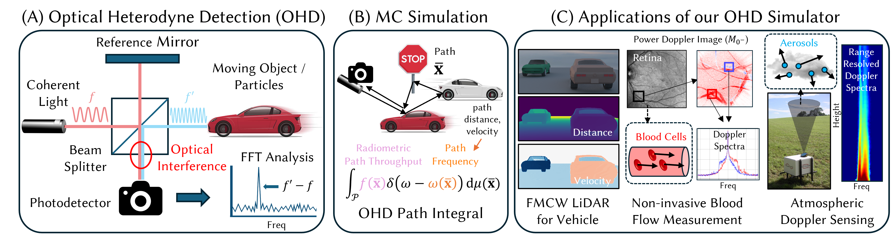

# Mitsuba0.6 OHD Renderer

### [Project Page](https://juhyeonkim95.github.io/project-pages/ohd_rendering/) | [Paper](https://dl.acm.org/doi/10.1145/3731150)



This repository is the official Mitsuba0.6 implementation of "A Monte Carlo Rendering Framework for Simulating Optical Heterodyne Detection" by 
[Juhyeon Kim](https://juhyeonkim.netlify.app/), 
[Craig Benko](http://craigbenko.com/), 
[Magnus Wrenninge](https://scholar.google.se/citations?user=aa85HZgAAAAJ&hl=en), 
[Ryusuke Villemin](https://www.linkedin.com/in/ryusuke-v-04649b1/), 
[Zeb Barber](https://www.linkedin.com/in/zeb-barber-a03020127/), 
[Wojciech Jarosz](https://cs.dartmouth.edu/~wjarosz/), 
[Adithya Pediredla](https://sites.google.com/view/adithyapediredla/)
(SIGGRAPH 2025, journal paper, 🏆 Honorable mention).

## Install
To compile, follow the original Mitsuba compliation guide at [here](https://github.com/mitsuba-renderer/mitsuba).

Instead of config, please use double precision and mono-channel config (`config_double_single.py`).

## Parameter Explanation
New integrators are added in `src/integrators/fmcw` folder, for OHD rendering.
Two types of laser are typically used for OHD rendering, standard laser with constant frequency and swept-frequency laser with a chirp.
FMCW (frequency-modulated continuous-wave) use swept-frequency laser with up and down chirp.
Since FMCW is the most general case of OHD, we named integrator as `fmcw`.

### Integrator Type
* `fmcw_instant_frequency`: frequency-domain PSD (Power Spectral Density) rendering, corresponding to Algorithm1 in the paper. It outputs [H x W x M] where M is histogram bin number.
* `fmcw_instant`: time-domain rendering with field sampling and random phase addition, corresponding to Algorithm2 in the paper. It outputs [H x W x M] where M is FFT sample number.

### Detailed Parameters
* `wavelength` : Laser wavelength in nanometer (default : 1550)
* `f_c` : Laser frequency in GHz. If `wavelength` is also defined, we use `wavelength` first (default : 193,414)
* `T` : Sweep time for one chirp in microsecond (default : 10)
* `B` : Signal bandwidth in GHz (default : 1)
* `M` : Number of time stamps used for FFT or histogram bin (default : 4096)
* `use_collimated` : Ignore light setting and use collimated laser (default : false)
* `fov_error` : Additional parameter to change laser FOV. If set to $a$, instead of uniform sample from whole pixel, we sample centered square-area with $2a$ (default : 0.5).
* `use_random_phase` : Whether to use random phase addition for `fmcw_instant`. (default : true)

## Usage
```
(TBA)
```


## Citation
If you find this useful for your research, please consider to cite:
```
@article{kim2025ohd,
    title={A Monte Carlo Rendering Framework for Simulating Optical Heterodyne Detection},
    author={Kim, Juhyeon and Benko, Craig and Wrenninge, Magnus and Villemin, Ryusuke and Barber, Zeb and Jarosz, Wojciech and Pediredla, Adithya},
    journal={ACM Transactions on Graphics (TOG)},
    volume={44},
    number={4},
    pages={1--18},
    year={2025},
    publisher={ACM New York, NY, USA}
}
```
