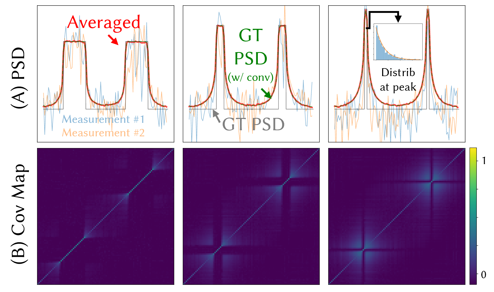

# Mitsuba OHD Rendering Tutorial

## About
We provide several tutorials for OHD rendering.

### Speckle Simulation for Simple Case (in `tutorial_speckle_simple`)
This example provides a simple simulation on two peak scenario as shown in Fig.7 in the main paper.
`main.py` does
* Evaluate normalized covariance matrix
* Evaluate power spectrum (to show Alg1 and Alg2 converge to the same result)
* Evaluate intensity histogram at specific frequency

### Doppler Simulation (in `tutorial_doppler_comparison`)
This example provides a microsurface simulation on Doppler effect (target vs spot velocity) which corresponds to Fig.10 in the main paper.
`main.py` does
* Evaluate PSD by generating microsurface (from Gaussian process) and actually moving it over each time stamp with field evaluation.
* Change condition of RMS height and correlation length (two parameters used for Gaussian surface generation)
